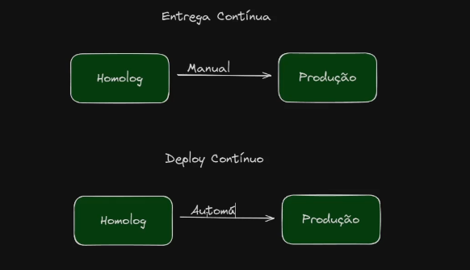

#### Git Flow

#### GitFlow na Prática

Crie um diretório fora do repo que baixou
#cd ..
#mkdir gitflowpratica
#git init
#code .

Crie uma branch
#git checkout -b developer
Switched to a new branch 'developer'
Para renomerar a branch
#git checkout -m develsls
#go mod init ajdominitini/gitflow
go: creating new go.mod: module ajdominitini/gitflow
#touch main.go
#cat main.go 
package main

import "fmt"

func main() {
        fmt.Println("Desenvolvimento")
}

#go run main.go
Desenvolvimento

Crie uma branch nova para feature
#git checkout -b feature/feature-gflow
Switched to a new branch 'feature/feature-gflow'

Adicione uma nova linha no codigo
#cat main.go 
package main

import "fmt"

func main() {
        fmt.Println("Desenvolvimento")
        fmt.Println("XPTO")
}

#git add .
#git commit -m "Nova linha no codigo"
[feature/feature-gflow c4ef161] Nova linha no codigo
 1 file changed, 1 insertion(+)

#git log
commit c4ef1619571acee954b82e89fa7890fbf0386210 (HEAD -> feature/feature-gflow)
Author: anderson.dominitini <anderson.dominitini@zetrasoft.com.br>
Date:   Thu Aug 8 16:27:16 2024 -0300

    Nova linha no codigo

commit d0168e4f4f031bf6af3774e7ea2748cd88015456 (developer)
Author: anderson.dominitini <anderson.dominitini@zetrasoft.com.br>
Date:   Thu Aug 8 16:20:14 2024 -0300

Volte pra brach developer
#git checkout developer
Switched to branch 'developer'

#git branch
* developer
  feature/feature-gflow

Faça o merge da git branch
#git merge feature/feature-gflow
Updating d0168e4..c4ef161
Fast-forward
 main.go | 1 +
 1 file changed, 1 insertion(+)

Crie a branch release
#git checkout -b release
Switched to a new branch 'release'

Crie a branch main
#git checkout -b main
Switched to a new branch 'main'

Crie um merge com a release
#git merge release
Already up to date.

#git log
commit c4ef1619571acee954b82e89fa7890fbf0386210 (HEAD -> main, release, feature/feature-gflow, developer)
Author: anderson.dominitini <anderson.dominitini@zetrasoft.com.br>
Date:   Thu Aug 8 16:27:16 2024 -0300

    Nova linha no codigo

commit d0168e4f4f031bf6af3774e7ea2748cd88015456
Author: anderson.dominitini <anderson.dominitini@zetrasoft.com.br>
Date:   Thu Aug 8 16:20:14 2024 -0300

Opa, deu um bug
#git checkout -b hotfix/correcao_xpto
Switched to a new branch 'hotfix/correcao_xpto'

cat main.go 
package main

import "fmt"

func main() {
        fmt.Println("Desenvolvimento")
        fmt.Println("XPTO")
        fmt.Println("hotfix-xpto")
}

#git add .
#git commit -m "Correcao xpto"

Muda pra branch main
#git checkout main
Switched to branch 'main

#git merge hotfix/correcao_xpto
Updating c4ef161..03eb88e
Fast-forward
 main.go | 1 +
 1 file changed, 1 insertion(+)

#go run main.go
Desenvolvimento
XPTO
hotfix-xpto

#git checkout developer
Switched to branch 'developer'
#go run main.go 
Desenvolvimento
XPTO
#git merge hotfix/correcao_xpto 
Updating c4ef161..03eb88e
Fast-forward
 main.go | 1 +
 1 file changed, 1 insertion(+)

#go run main.go 
Desenvolvimento
XPTO
hotfix-xpto

#### Automacao CI/CD

# Automação, Pipelines e DevOps
Automaçao é uma das palavras chaves no mundo devops.
Pipeline controla o fluxo de processos dentro de uma execução.

# Pipeline de CI
Continuous Integration. Integrar novos códigos novos em um projeto ja existente. Resultam em uma nova versão. Uma nova release.
Para integrar o novo código, deve se garantir a qualidade dele.

# Pipeline de CD
Continuous Deploiment (entrega continua). Vem depois do CI.Garante que esse novo pacote seja entregue pro cliente. Procure entregar incialmente em um ambiente de homologação.
Para promover para de um ambiente dev para prod, tem uma etapa

# CI-CD diferencás

